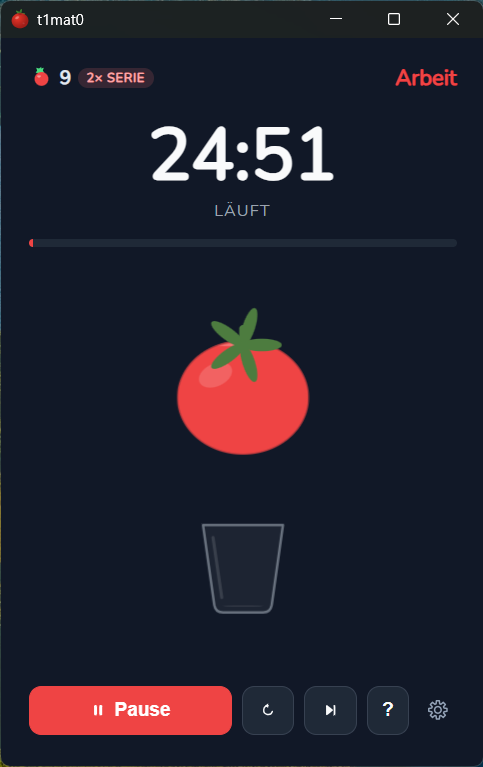
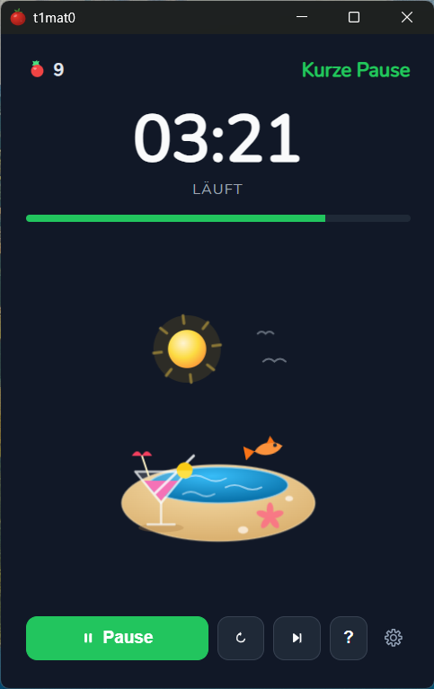
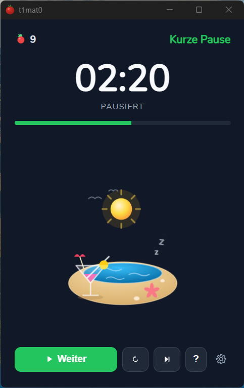
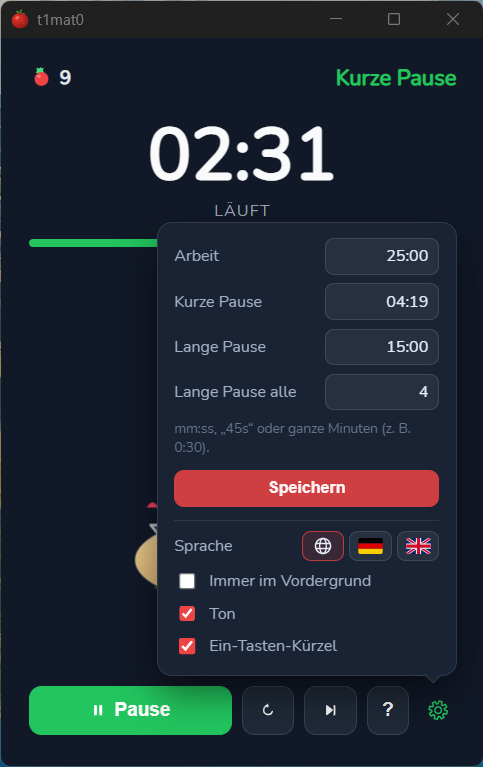
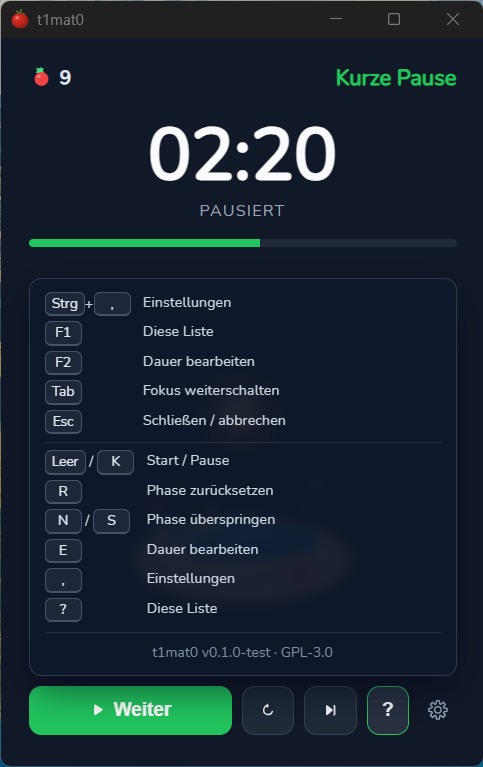

# t1mat0 — Pomodoro Timer

[](https://github.com/sebastian-x86/t1mat0/actions/workflows/ci.yml)
[](#3-ohne-gui-testen)
[](https://go.dev)
[](https://wails.io)
[](https://react.dev)
[](#plattform-unterschiede)
[](https://github.com/sebastian-x86/t1mat0/releases/latest)
[](LICENSE)

**t1mat0** ist ein kleiner Desktop-Pomodoro-Timer, der die verbleibende Zeit
nicht nur als Zahl zeigt, sondern als Tomate, die sich langsam in ein Glas
entleert — Tray, Desktop-Benachrichtigungen, Always-on-Top und Sound inklusive.

Ausgesprochen wird der Name wie das englische *tomato*: **[tə-ˈmaa-toh]**
(IPA: `/təˈmɑːtəʊ/`), also „te-MAA-toh" — die `1` und die `0` sind nur Leetspeak
für `i` und `o`. Die Binary heißt kurz `t1m` („tim").

In der Mitte des Fensters läuft eine Tomate über die Dauer der Phase langsam
leer und tropft in ein Glas darunter, das sich im gleichen Maß füllt — die
Restzeit ist damit auch ohne Blick auf die Uhr ablesbar. Die Farbe folgt der
aktuellen Phase (rot = Arbeit, grün = kurze Pause, blau = lange Pause).

Der Name ist eine Kreuzung aus *timer* und *tomato* — die Tomate ist das
Namensgebende der Pomodoro-Technik.



**Stack:** Go (Timer-Logik, Tray, Benachrichtigungen, Persistenz) +
React/TypeScript (Oberfläche, SVG-Szenen), zusammengebaut mit
[Wails v2](https://wails.io) zu einer einzelnen nativen Binary — kein
Electron, keine Laufzeitumgebung, keine Installation nötig.
**Zielplattformen:** Windows und macOS. Linux funktioniert zum Entwickeln, aber ohne Tray (siehe [Plattform-Unterschiede](#plattform-unterschiede)).

### Auf einen Blick

- **Zeit als Bild:** Tomate leert sich, Glas füllt sich; in der Pause eine
  Strandszene mit springenden Fischen (siehe [Szenen](#szenen))
- **Zweisprachig:** Deutsch und Englisch, automatisch nach OS-Sprache
  (siehe [Sprache](#sprache))
- **Hell und dunkel:** folgt dem System oder fest eingestellt
  (siehe [Design](#design))
- **Komplett per Tastatur bedienbar**, mit abschaltbaren Ein-Tasten-Kürzeln
  (siehe [Tastatur](#tastatur))
- **Barrierefrei gedacht:** Live-Region, ARIA-Rollen, sichtbarer Fokus,
  `prefers-reduced-motion` (siehe [Barrierefreiheit](#barrierefreiheit))
- **Sekundengenaue Zeiten**, direkt im Uhrenfeld editierbar — tippen oder
  scrollen (siehe [Zeit direkt ändern](#zeit-direkt-ändern))
- **Kleine Belohnung:** gesammelte Tomaten und Serien
  (siehe [Tomaten sammeln](#tomaten-sammeln))
- **Portabel:** läuft ohne Installation vom USB-Stick
  (siehe [Portable Modus](#portable-modus))

## Quickstart

### 1. Voraussetzungen

- **Go** 1.22+ (Wails lädt die benötigte Toolchain automatisch nach)
- **Node.js** 20+
- **Wails CLI**:
  ```bash
  go install github.com/wailsapp/wails/v2/cmd/wails@latest
  ```
  Die CLI liegt danach unter `~/go/bin/wails`. Wenn `~/go/bin` nicht in `$PATH`
  ist, ruf sie mit dem vollen Pfad auf (wie unten gezeigt).

**Zusätzlich unter Linux** (Ubuntu 24.04) für den Webview:

```bash
sudo apt install -y libgtk-3-dev libwebkit2gtk-4.1-dev
```

### 2. App starten

```bash
cd ~/git/t1mat0

# WSL2 (empfohlen): als native Windows-App bauen und starten
~/go/bin/wails build -platform windows/amd64 && ./build/bin/t1m.exe

# Linux / WSLg (braucht den webkit2_41 Tag)
~/go/bin/wails dev -tags webkit2_41

# Windows / macOS
~/go/bin/wails dev
```

`wails dev` startet die App mit Hot Reload: Änderungen an der React-UI sind
sofort sichtbar, Änderungen am Go-Code lösen einen Neustart aus.
Beenden mit `Ctrl+C`.

### 3. Ohne GUI testen

Die Timer-Logik ist reines Go und hat keine GUI-Abhängigkeiten — die Tests
laufen also auch ohne die apt-Pakete oben:

```bash
go test ./...                      # Timer, Settings, Ernte, Sprache
go test . -cover                   # mit Abdeckung (aktuell ~77 %)
```

Der Coverage-Badge oben liest seinen Wert aus dem Branch `badges`, den die CI
nach jedem Merge auf `main` neu schreibt; fällt die Abdeckung unter 70 %,
schlägt der Build fehl.

Abgedeckt sind die Zustandsmaschine (Phasenwechsel, Tick, Auto-Start), die
Validierung aller Zeitwerte, das Laden und Speichern von `settings.json` und
`harvest.json` inklusive kaputter, unvollständiger und veralteter Dateien
sowie die App-Methoden, die das Frontend aufruft.

Die Zeitlogik der Oberfläche (mm:ss parsen, Ziffern tippen, Mausrad-Schritte)
steckt in `frontend/src/duration.ts` und ist frei von DOM-Zugriffen, damit sie
mit Vitest geprüft werden kann:

```bash
cd frontend
npm test                           # einmalig
npm run test:watch                 # im Watch-Modus
npm run lint                       # oxlint inkl. der React-Hooks-Regeln
npm run format                     # Prettier
```

Auf der Go-Seite prüft `golangci-lint run --build-tags webkit2_41 ./...`
dasselbe, was die CI im Job *Go lint* ausführt.

Nicht getestet sind bewusst die Wails-Bindings selbst (Fenster, Tray,
Benachrichtigungen) und die SVG-Szenen — beides braucht eine laufende Runtime
bzw. ein Auge.

## Bedienung

In der unteren Zeile sitzen alle Bedienelemente: der breite Start-/Pause-Button,
daneben zwei Icon-Buttons (Kreispfeil = zurücksetzen, Doppelpfeil =
überspringen), dahinter `?` für die Kurzbefehle und das Zahnrad für die
Einstellungen. Die Icon-Buttons tragen ihre Beschriftung im Tooltip — so passt
die Zeile in jeder Sprache ins Fenster.

| Aktion | Fenster | Tray (Windows/macOS) |
| --- | --- | --- |
| Start / Pause | Button `Start` / `Pause` / `Weiter` | Menüeintrag |
| Zurücksetzen | Icon-Button (Kreispfeil) | Menüeintrag |
| Phase überspringen | Icon-Button (Doppelpfeil) | Menüeintrag |
| Dauer der Phase ändern | Klick auf die Uhr | — |
| Einstellungen | Zahnrad unten rechts | — |
| Kurzbefehle anzeigen | Button `?` | — |
| Always on Top | Checkbox (Zahnrad-Menü) | Checkbox |
| Sound an/aus | Checkbox (Zahnrad-Menü) | Checkbox |
| Benachrichtigungen an/aus | Checkbox (Zahnrad-Menü) | — |
| Sprache | Flaggen-Auswahl (Zahnrad-Menü) | — |
| Design (hell/dunkel) | Symbol-Auswahl (Zahnrad-Menü) | — |
| Schließen in den Infobereich | Checkbox (Zahnrad-Menü) | — |
| Fenster ein-/ausblenden | — | `Show / Hide` |
| Beenden | — | `Quit` |

### Zeit direkt ändern

Ein Klick auf die Restzeit (oder `F2`) macht daraus ein `mm:ss`-Feld, das sich
wie ein Uhren-Widget verhält:

- **Tippen ohne Doppelpunkt:** Ziffern füllen erst die Minuten und springen
  nach zwei Stellen selbst zu den Sekunden. Sekunden laufen nie über `59`.
- **Mausrad:** über den Minuten ändert es die Minuten, über den Sekunden die
  Sekunden. `Shift` erzwingt Sekundenschritte.
- **Pfeiltasten:** `←`/`→` wechseln das Segment, `↑`/`↓` ändern es um eins.
- `Enter` übernimmt, `Esc` verwirft. Buchstaben werden gar nicht erst
  angenommen.

Die neue Dauer gilt sofort für die laufende Phase und wird als neuer Standard
für diesen Phasentyp gespeichert. Dasselbe Mausrad-Verhalten haben auch die
Felder im Einstellungsmenü.

### Tastatur

Alle Bedienelemente sind per `Tab` erreichbar und mit `Enter`/`Space`
auslösbar; der Fokus ist sichtbar umrandet.

| Taste | Aktion |
| --- | --- |
| `Ctrl` + `,` | Einstellungen öffnen/schließen |
| `F1` | Kurzbefehl-Übersicht |
| `F2` | Dauer der aktuellen Phase bearbeiten |
| `Esc` | Schließen bzw. Eingabe abbrechen |

Zusätzlich gibt es Ein-Tasten-Kürzel (aktiv, solange nicht in ein Eingabefeld
getippt wird):

| Taste | Aktion |
| --- | --- |
| `Space` / `K` | Start / Pause |
| `R` | Phase zurücksetzen |
| `N` / `S` | Phase überspringen |
| `E` | Dauer der aktuellen Phase bearbeiten |
| `,` | Einstellungen öffnen/schließen |
| `?` | Kurzbefehl-Übersicht |

Diese Buchstaben-Kürzel lassen sich in den Einstellungen über
**Single-key shortcuts** abschalten — WCAG 2.1 SC 2.1.4 verlangt das, weil
Sprachsteuerung und Screenreader einzelne Buchstaben ungewollt auslösen. Die
Kürzel mit `Ctrl` bzw. `F1`/`F2` bleiben davon unberührt.

## Barrierefreiheit

Die App ist ohne Maus vollständig bedienbar und für Screenreader ausgezeichnet:

- **Live-Region** (`role="status"`, `aria-live="polite"`) meldet Phase, Status
  und Restzeit, ohne die Vorlesereihenfolge zu unterbrechen.
- **Fortschrittsleiste** als `role="progressbar"` mit `aria-valuenow` und einem
  gesprochenen `aria-valuetext` („45 Prozent, 12:30 verbleibend").
- **Icon-Buttons** tragen `aria-label` und `title`, die Sprachauswahl ist eine
  `radiogroup`, das Einstellungsmenü ein `role="dialog"` mit Fokusführung
  hinein und zurück, Fehlermeldungen sind `role="alert"`.
- **Sichtbarer Fokus** über `:focus-visible`, `Esc` schließt jedes Overlay.
- **Dekoration bleibt stumm:** die SVG-Szenen sind `aria-hidden`.
- **`prefers-reduced-motion`** schaltet Animationen ab — die schlafenden „z"
  stehen still und das Zermatschen der Tomate beim Überspringen entfällt
  komplett (WCAG 2.1 SC 2.3.3).
- **Ein-Tasten-Kürzel sind abschaltbar** (WCAG 2.1 SC 2.1.4, siehe oben).

## Szenen

Was in der Fenstermitte passiert, hängt von Phase und Status ab:

| Situation | Szene |
| --- | --- |
| Arbeitsphase | Tomate leert sich in ein Glas, Farbe rot |
| Kurze Pause | Strand mit Sonne, Cocktail und springenden Fischen, grün |
| Lange Pause | dieselbe Strandszene, ruhiger und blau |
| Angehalten | kleine „z" steigen auf — aus der Tomate bzw. aus dem Wasser |
| Arbeitsphase übersprungen | ein Fuß zertritt die Tomate ins Glas |

Die Fortschrittsleiste läuft in Arbeitsphasen vorwärts und in Pausen rückwärts,
damit „die Pause schrumpft" auch am Balken ablesbar ist.

| | |
| --- | --- |
|  |  |
| Kurze Pause — Strand statt Tomate | Angehalten — die Szene schläft mit |
|  |  |
| Einstellungen — Dauern und Sprache | `F1` — alle Tastenkürzel auf einen Blick |

## Sprache

Die Oberfläche, das Tray-Menü und die Benachrichtigungen gibt es auf **Deutsch
und Englisch**. Standardmäßig richtet sich die App nach der Sprache des
Betriebssystems (`GetUserDefaultLocaleName` unter Windows, `LC_ALL`/`LANG` sonst)
— alles, was mit `de` beginnt, ergibt Deutsch, alles andere Englisch.

Im Zahnrad-Menü lässt sich das über **Sprache / Language** überschreiben:
`Automatisch (System)`, `Deutsch` oder `English`. Die Wahl landet als
`language` in der `settings.json` und wirkt sofort, auch im Tray.

## Design

Das Fenster gibt es in **Hell und Dunkel**. Voreingestellt ist
`Automatisch (System)`: die App übernimmt das Farbschema des Betriebssystems
(`prefers-color-scheme`) und wechselt mit, wenn es im laufenden Betrieb
umgestellt wird.

Im Zahnrad-Menü lässt sich das über **Design / Theme** festnageln:
`Automatisch (System)`, `Hell` oder `Dunkel`. Die Wahl landet als `theme` in
der `settings.json` und gilt sofort. Die Phasenfarben (rot, grün, blau) sind im
hellen Design etwas dunkler, damit Text auf farbigen Flächen den Kontrast von
WCAG 2.1 AA hält.

## Benachrichtigungen

Am Ende jeder Phase kommt eine Systembenachrichtigung — die des Betriebssystems,
keine nachgebaute. Der Titel trägt ein Emoji je Phase (🍅 Arbeit, ☕ kurze Pause,
🌴 lange Pause), das Anwendungssymbol daneben ist die Tomate aus der Exe. Nach
einer Arbeitsphase steht die Ernte im Text: Anzahl der Tomaten und, ab zwei am
Stück, die laufende Serie.

Dazu gibt es Knöpfe direkt in der Benachrichtigung:

| Nach der Phase | Knöpfe |
| --- | --- |
| Arbeit | `Pause starten`, `Pause überspringen` |
| Pause | `Weiterarbeiten`, `Fenster zeigen` |

`Pause starten` und `Weiterarbeiten` starten den Timer nur, wenn er nicht
ohnehin schon läuft (`autoStartNext`). Ein Klick auf die Benachrichtigung selbst
holt das Fenster nach vorn.

Abschalten lässt sich das im Zahnrad-Menü über **Benachrichtigungen**; die
Wahl landet als `notificationsEnabled` in der `settings.json`. Der Chime hängt
an einer eigenen Einstellung, beides ist unabhängig voneinander.

Unter Windows liefert Wails die Toast-Registrierung samt Symbol mit; auf
Plattformen ohne Unterstützung für Knöpfe fällt die Benachrichtigung
automatisch auf die schlichte Variante mit Titel und Text zurück.

## Tomaten sammeln

Rechts oben zeigt ein kleines HUD eine Tomate mit der Anzahl der geernteten
Tomaten — wie Münzen oder Sterne in einem Jump'n'Run. Eine Tomate gibt es
**nur**, wenn eine Arbeitsphase von selbst ausläuft:

- `Skip` in einer Arbeitsphase zermatscht die Tomate: die **Serie** fällt auf
  null, die bereits gesammelten Tomaten bleiben erhalten.
- `Reset` beendet die Serie ebenfalls.
- Ab zwei Phasen in Folge erscheint ein `n× streak`-Badge, die Bestmarke wird
  mitgeführt (Tooltip).

Gespeichert wird das in `harvest.json` neben der `settings.json` (bzw. im
portablen Modus neben der Binary).

## Entwicklung unter WSL2

Das Projekt lässt sich vollständig aus WSL2 heraus bauen und starten. Es gibt
zwei Wege — der zweite ist der bessere:

### Variante A: Linux-App über WSLg

```bash
sudo apt install -y libgtk-3-dev libwebkit2gtk-4.1-dev
~/go/bin/wails dev -tags webkit2_41
```

Das Fenster erscheint über WSLg. Gut für UI-Arbeit mit Hot Reload,
**aber ohne Tray und ohne Benachrichtigungen** (WSLg hat weder System-Tray noch
einen D-Bus-Notification-Daemon).

### Variante B: Windows-App aus WSL bauen und starten (empfohlen)

```bash
~/go/bin/wails build -platform windows/amd64
./build/bin/t1m.exe
```

Dank WSL-Interop startet die `.exe` direkt als **native Windows-App** — mit
Tray-Icon, Windows-Benachrichtigungen und Always-on-Top. Das ist der
realistischste Test, weil Windows eine der Zielplattformen ist.

Tipp: Läuft spürbar schneller, wenn die Exe im Windows-Dateisystem liegt:

```bash
cp build/bin/t1m.exe /mnt/c/temp/ && /mnt/c/temp/t1m.exe
```

## Releases und Versionierung

Fertige Binaries hängen an den
[Releases](https://github.com/sebastian-x86/t1mat0/releases/latest):
`t1mat0-vX.Y.Z-windows-amd64.exe` und ein universelles macOS-Bundle als ZIP.
Beide sind nicht signiert — Windows SmartScreen und macOS Gatekeeper wollen
beim ersten Start eine Bestätigung.

### Download prüfen

An jedem Release hängt eine Datei `SHA256SUMS` mit der Prüfsumme jedes
Artefakts. Sie wird in der CI aus genau den hochgeladenen Dateien erzeugt.

```powershell
# Windows (PowerShell), Ausgabe mit der Zeile in SHA256SUMS vergleichen
Get-FileHash .\t1mat0-vX.Y.Z-windows-amd64.exe -Algorithm SHA256
```

```bash
# macOS/Linux, im Ordner mit den Downloads und der SHA256SUMS
shasum -a 256 --ignore-missing -c SHA256SUMS
```

Das belegt, dass die Datei unterwegs nicht verändert wurde. Es ersetzt keine
Signatur: Wer die Prüfsummen-Datei austauschen könnte, könnte auch die Binary
austauschen. Beides zusammen liegt auf der Release-Seite.

Versioniert wird nach [SemVer](https://semver.org), erzeugt aus den
Commit-Nachrichten ([Conventional Commits](https://www.conventionalcommits.org)):

- `fix:` → Patch, `feat:` → Minor, `feat!:`/`BREAKING CHANGE:` → Major
- `release-please` sammelt die Commits auf `main` in einer Release-PR mit
  Versionsbump und `CHANGELOG.md`
- Wird sie gemergt, entstehen Tag und Release, und die CI baut und veröffentlicht
  die Binaries
- Die eingebaute Version steht in der Kurzbefehl-Übersicht (`F1`)

Details und die Regeln für Beiträge stehen in [CONTRIBUTING.md](CONTRIBUTING.md).
Es gilt der [Verhaltenskodex](CODE_OF_CONDUCT.md). Sicherheitslücken bitte
nicht öffentlich melden, sondern wie in [SECURITY.md](SECURITY.md) beschrieben.

## Bauen

```bash
# Windows portable .exe (funktioniert auch als Cross-Build von Linux aus)
~/go/bin/wails build -platform windows/amd64

# macOS App Bundle — muss auf einem Mac gebaut werden (cgo/Cocoa nötig)
~/go/bin/wails build -platform darwin/universal

# Linux (lokal)
~/go/bin/wails build -tags webkit2_41
```

Artefakte landen unter `build/bin/`.

Die Windows-`.exe` ist eine einzelne, eigenständige Datei (~12 MB) und läuft
**ohne Installation**.

## Portable Modus

Standardmäßig liegen die Einstellungen im User-Config-Verzeichnis
(z. B. `~/.config/t1mat0/settings.json`).

Legt man eine leere Datei **`portable.txt` neben die Exe**, speichert die App
ihre `settings.json` stattdessen im selben Ordner — damit ist sie komplett
self-contained, z. B. für einen USB-Stick.

## Plattform-Unterschiede

| Feature | Windows | macOS | Linux (nativ) | WSL2 / WSLg |
| --- | --- | --- | --- | --- |
| Timer, Settings, Persistenz | ✅ | ✅ | ✅ | ✅ |
| Desktop-Benachrichtigungen | ✅ | ✅ | ✅ (D-Bus) | ❌ (kein Daemon) |
| Always on Top | ✅ | ✅ | ✅ | ⚠️ compositor-abhängig |
| Sound bei Phasenwechsel | ✅ | ✅ | ✅ | ✅ (PulseAudio) |
| Tray-Icon mit Menü | ✅ | ✅ | ❌ | ❌ |
| Schließen minimiert in Tray | ✅ (abschaltbar) | ✅ (abschaltbar) | ❌ (beendet) | ❌ (beendet) |

Linux ist bewusst nur Entwicklungsplattform: Das Tray-Menü ist über Build-Tags
auf Windows/macOS beschränkt (`internal/tray/tray_desktop.go` vs. `internal/tray/tray_stub.go`).
Unter WSL2 daher am besten die Windows-Exe testen (siehe
[Entwicklung unter WSL2](#entwicklung-unter-wsl2)).

## Einstellungen

Die Einstellungen klappen aus dem Zahnrad unten rechts nach oben auf: Dauern,
Long-Break-Intervall, Sprache, Design, Always on Top, Sound,
Benachrichtigungen, das Verhalten beim Schließen und die Ein-Tasten-Kürzel.
Die Restzeit lässt sich zusätzlich direkt im Uhrenfeld überschreiben (siehe
[Zeit direkt ändern](#zeit-direkt-ändern)).

Gespeichert wird in `settings.json` — unter Windows in
`%AppData%\t1mat0\`, unter Linux in `~/.config/t1mat0/`, im portablen Modus
neben der Binary.

| Einstellung | Default | Bedeutung |
| --- | --- | --- |
| `workSeconds` | 1500 | Dauer einer Arbeitsphase (Sekunden) |
| `shortBreakSeconds` | 300 | Dauer der kurzen Pause (Sekunden) |
| `longBreakSeconds` | 900 | Dauer der langen Pause (Sekunden) |
| `longBreakEvery` | 4 | Nach wie vielen Arbeitsphasen die lange Pause kommt |
| `language` | "auto" | Sprache: `auto` (vom System), `de` oder `en` |
| `theme` | "auto" | Design: `auto` (vom System), `light` oder `dark` |
| `notificationsEnabled` | true | Benachrichtigung beim Phasenende |
| `closeToTray` | true | Schließen versteckt das Fenster im Infobereich, statt zu beenden |
| `alwaysOnTop` | false | Fenster immer im Vordergrund |
| `soundEnabled` | true | Chime bei Phasenwechsel |
| `singleKeyShortcuts` | true | Ein-Tasten-Kürzel (`Space`, `R`, `N`, …) aktiv |
| `autoStartNext` | true | Nächste Phase automatisch starten |

Die Dauern werden in Sekunden gespeichert, damit auch Zeiten unter einer
Minute möglich sind. Im Einstellungsdialog kann man sie als `mm:ss` (`0:30`),
mit Sekunden-Suffix (`45s`) oder als blanke Minutenzahl (`25`) eingeben.
Alle Zeitwerte werden im Backend validiert (1 Sekunde bis 600 Minuten).

Ältere `settings.json` mit `workMinutes`/`shortBreakMinutes`/`longBreakMinutes`
werden beim Laden automatisch auf Sekunden migriert.

## Icon

App-, Taskleisten- und Tray-Icon sind eine gerenderte Tomate. Die Dateien
`build/appicon.png` und `build/windows/icon.ico` werden erzeugt von:

```bash
go run ./tools/icongen build/appicon.png build/windows/icon.ico
```

## Projektstruktur

```
internal/timer/        Pomodoro-Zustandsmaschine, Settings und Ernte (pure Go)
internal/store/        Laden/Speichern von Settings und Ernte, Portable-Erkennung
internal/i18n/         Übersetzungen und Spracherkennung (Go-Seite)
internal/tray/         Tray-Menü (Windows/macOS, fyne.io/systray) plus No-op-Stub
app.go                 Wails-Bindings, Ticker, Notifications, Fenstersteuerung
app_test.go            Tests der gebundenen Methoden inkl. Persistenz
main.go                Wails-App-Konfiguration
tray_icon_windows.go   Tray-Icon für Windows (.ico, go:embed)
tray_icon_darwin.go    Tray-Icon für macOS (.png, go:embed)
tray_icon_other.go     Kein Icon auf allen anderen Plattformen
wails.json             Wails-Projektkonfiguration
version.txt            Aktuelle Version, gepflegt von release-please
CHANGELOG.md           Automatisch aus den Commit-Nachrichten erzeugt
CONTRIBUTING.md        Commit-Konvention, Tests, Release-Ablauf
SECURITY.md            Wie Sicherheitslücken gemeldet werden
.github/workflows/     CI (Tests, Coverage-Badge), CodeQL und Release
build/                 Icons, Installer-Vorlagen, Build-Artefakte
frontend/src/App.tsx   React-Wurzel: Zustand, Szenenauswahl, Verdrahtung
frontend/src/components/   Clock, SettingsPanel, ShortcutHelp, ActionBar,
                       HarvestHud, LanguagePicker, ThemePicker und die SVG-Szenen
                       TomatoDrip, BeachScene, SnoozeZs — Styles je Komponente
                       daneben (z. B. Clock.css)
frontend/src/hooks/    useClockEdit, useShortcuts, useWheel
frontend/src/lib/      DOM-Helfer: clockPointer (mm:ss unter dem Mauszeiger),
                       motion (prefers-reduced-motion), theme (hell/dunkel)
frontend/src/styles/   theme.css (Farbtokens hell/dunkel), base.css (Fenster,
                       Phasenfarben), segmented.css (Sprach-/Design-Auswahl)
                       und a11y.css (Fokus)
frontend/src/i18n.ts   Deutsch/Englisch-Wörterbuch der Oberfläche
frontend/src/duration.ts   mm:ss-Logik der Uhr (mit Vitest getestet)
frontend/wailsjs/      Generierte Go-Bindings (nicht manuell bearbeiten)
```

Nach Änderungen an den öffentlichen Methoden von `App` die Bindings neu
generieren:

```bash
~/go/bin/wails generate module
```

## Lizenz

[GPL-3.0](LICENSE) — nutzen, ändern und weitergeben ist ausdrücklich erwünscht;
wer eine veränderte Fassung verteilt, muss deren Quellcode ebenfalls unter
GPL-3.0 offenlegen.
